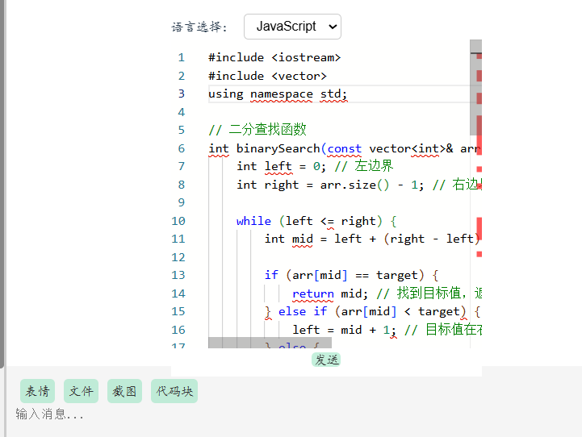

# 🐝 TalkHive - 多功能网页版聊天与学习平台

TalkHive 是一个专为学生与开发者设计的**免安装、开箱即用的网页聊天工具**。不仅支持基础聊天，还集成了代码编辑、笔记记录、DDL 管理、链接收藏等学习功能，让你在一个网页中实现社交与工作的无缝融合。

---

## 📌 项目特色

### 💬 聊天模块
- 私聊、群聊支持
- 聊天记录保存
- 通讯录管理与自定义标签分类

### 📚 学习与协作
- **工作区**：支持笔记编辑、代码编写（含语法高亮）、文件传输
- **代码编辑器**：集成 Monaco Editor，支持语言识别、补全、发送
- **DDL 提醒器**：任务与截止时间一览无余
- **链接器**：保存常用网址、作业提交入口等，快捷访问

### 🎨 个性化
- 支持浅色 / 深色 / 暖色主题
- 字体大小、聊天背景可自定义

---

## 📷 项目截图

#### 聊天：
实现了聊天室最基础的聊天对话功能，用户可以和自己的好友进行聊天也可以创建群聊实现多人聊天。


#### 通讯录：
不仅支持好友和群聊管理，还允许用户自定义标签分类，帮助用户快速查找和组织联系人，提升沟通效率。


#### 工作区：
工作区集成了笔记、代码编辑、DDL 提醒和收藏功能，为用户提供一站式的办公和学习环境，提升效率。
##### -笔记：
可编辑笔记，修改标签，为笔记添加标签，按标签查看笔记。


##### -代码：
代码编写功能提供语法高亮，帮助用户更清晰地记录和阅读代码片段，提升学习和开发效率。


此外，在聊天中，用户也可以直接编辑和发送代码，享受语法高亮、语言识别和自动补全功能，提升代码分享和协作效率。：



##### -DDL：
支持按时间优先级排序，帮助用户更好地管理任务和 deadlines。


##### -回收站：
用户可以找到已删除的文件，并随时恢复误删的内容，避免因操作失误导致的数据丢失。


#### 链接器：
用户可以保存老师发放的 PPT 地址、作业提交链接或者一些常用的网址，随时一键访问，告别反复查找的麻烦。


#### 个性化设置：
支持个性化定制，用户可调整字体大小、主题颜色、聊天背景等，打造专属使用体验。


##### -主题颜色：

| 浅色（系统默认） | 深色 | 暖色 |
|----------|----------|---------------------|
|  |  |  |

---

## 🛠️ 技术栈

- **前端**：Vue 3, Monaco Editor
- **后端**：go, Redis
- **工具**：Postman, GitHub, VSCode

---

## 🚀 快速启动
### 1. 克隆项目

```bash
git clone https://github.com/winner1coming/TalkHive
cd TalkHive
```

#### 安装go语言环境：https://go.dev/dl/

###### 在环境变量窗口中添加 GOROOT 变量，值为 Go 的安装目录（例如 C:\Go ）
###### 添加 GOPATH 变量，值为你选择的工作区路径（可以自由设置）
###### 将 Go 安装目录下的 bin 文件夹目录添加到 Path 环境变量中
###### 打开 cmd 输入 go version 查看是否成功安装

#### 安装Redis
###### https://github.com/redis-windows/redis-windows/releases

#### 配置Redis
###### 将 Redis 安装目录配置到 Path 中（例如 D:\Software\Redis-x64-5.0.14.1 ）
###### 启动 Redis ：以下两者皆可
```bash
redis-server.exe
redis-server
```
#### 调整后端配置文件（ config 文件夹中的 config.yaml 文件）：
###### 调整 database 中的 dsn （只需调整这几个即可，其余默认）：
root 为 Mysql 中的用户名称
123456 为密码
talkhive 为数据库名称

#### 启动后端：
###### 1. 切换到后端项目目录： 
```bash
cd Backend
```
###### 2. 运行后端： 
```bash
go run main.go
```
#### 启动前端：
###### 切换到前端目录：
```bash
cd Frontend
```

###### 确保已安装 Node.js 和 npm：

```bash
node -v
npm -v
```
###### 安装项目依赖：
```bash
npm install
```
###### 启动：
```bash
npm run dev
```

